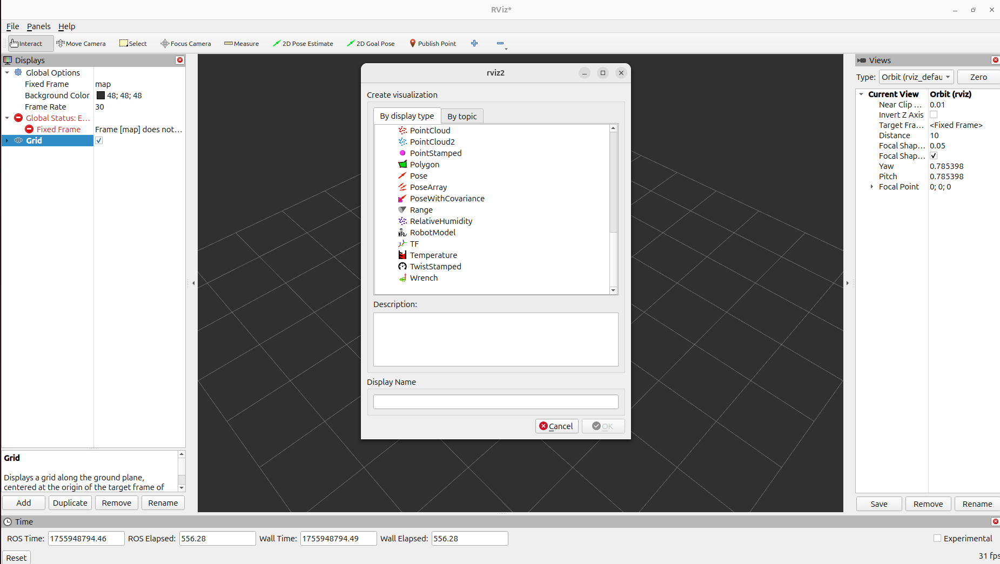
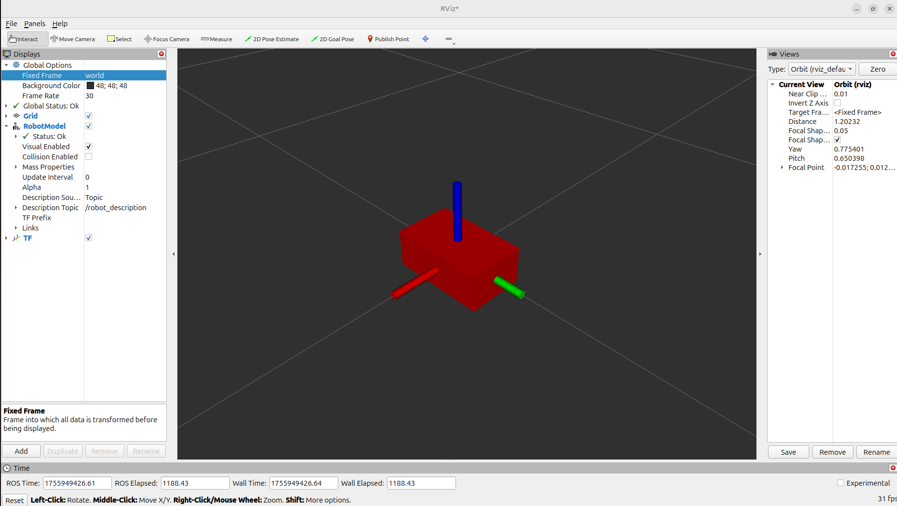

# ROS2-jazzy-workshop-01
Robot modeling is the cornerstone of modern robotics. The Unified Robot Description Format (URDF) is an XML-based language used in ROS to describe all aspects of a robot, including its physical structure, joints, and sensors. While URDF is powerful, its true potential is unleashed when combined with Xacro (XML Macros), which allows for the creation of reusable code snippets (macros) and mathematical calculations. This modular approach drastically simplifies the creation of complex robot models and makes it easier to manage and modify them. A solid understanding of these description files is crucial for any robotics developer, as many simulation failures in Gazebo, like unexpected collisions or unstable dynamics, often stem from incorrect robot descriptions, such as improperly defined masses or inertias.

During the modeling process, RViz, the ROS visualization tool, is an invaluable asset. It allows you to visualize your robot's URDF model, check for correct joint properties, and verify that all links, masses, and inertias are properly configured before you even attempt to simulate it. This early-stage validation saves significant time and effort. Ultimately, a properly described robot model is a prerequisite for effective simulation in Gazebo. Gazebo is a powerful 3D robotics simulator that provides a realistic environment to test and validate robot behaviors, from simple movements to complex sensor interactions, and is essential for developing and testing algorithms without the need for physical hardware.

Objectives Upon completion of this lab sheet, you will be able to:

- Create a ROS 2 package and navigate its structure.
- Understand and effectively use URDF, Xacro, and Macro for robot modeling.
- Understand the properties of different joint types and links.
- Familiarize yourself with the RViz visualization tool for model validation.
- Familiarize yourself with the Gazebo simulator and the gz_ros_bridge for communication with ROS 2.

Task 01: Setting up Your ROS 2 Workspace
========================================
This task will guide you through the process of setting up a new ROS 2 workspace and a dedicated package for your robot's description files.

Create Your Workspace Directory
-------------------------------
First, you'll create a new workspace directory for this workshop. Please replace **XX** with your batch number to personalize your workspace name. For example, if you are from the **22nd batch**, your workspace name will be **workshop_22_ws**.

    mkdir -p workshop_xx_ws/src
    
Next, navigate into your newly created workspace directory.

    cd workshop_xx_ws/src

Create the Robot Description Package
------------------------------------
Next, create a new ROS 2 package specifically for your robot's description files. We'll name this package robot_description. The --build-type ament_cmake flag specifies the build system we'll be using.

    ros2 pkg create --build-type ament_cmake robot_description
Add Your Workspace to VS Code
-----------------------------
For easier editing and project navigation, it's recommended to add your workspace's src folder to your VS Code environment.
- Open VS Code.
- Go to File > Add Folder to Workspace...
- select your workshop_XX_ws/src directory.

Create Necessary Folders
------------------------
To maintain a clean and organized package structure, please create three new folders inside your workshop_XX_robot_description package directory: **launch**, **urdf**, and **config**. These folders will be used to store your launch files, URDF/Xacro files, and configuration files, respectively.

Edit the CMakeLists.txt File
----------------------------
You need to modify your package's CMakeLists.txt file to ensure that the newly created folders and their contents are installed correctly. This step is crucial for making your files accessible to ROS 2.
After the line **find_package(ament_cmake REQUIRED)**, add the following:

    install(
    DIRECTORY urdf launch config
    DESTINATION share/robot_description
    )

Build Your Package
------------------
Finally, build your new package to compile any changes and make it available in your ROS 2 environment. You must execute this command from the **root of your workspace (workshop_XX_ws)**.
    
    colcon build
After a successful build ,source your workspace

    source install/setup.bash

Task 02: Creating a Simple URDF and Visualizing in RViz
=======================================================
In this task, you'll create a basic URDF file to model a simple robot and learn how to visualize it using RViz. This will help you verify your model's structure before moving to more complex simulations.
Create Your URDF File
---------------------
First, inside the urdf folder you created earlier, create a new file named robot_model.urdf. This file will contain the complete description of your robot.
**robot_model.urdf;**
    
    <?xml version="1.0" ?>
    <robot name="robot_model">
        <link name="world"/>
        <link name="base_link">
            <visual>
                <geometry>
                    <box size="0.3 0.2 0.05"/>
                </geometry>
            </visual>
        </link>
        
        <joint name="world_to_base" type="fixed">
            <parent link="world"/>
            <child link="base_link"/>
            <origin xyz="0 0 0" rpy="0 0 0"/>
        </joint>
        
    </robot>  

Create the Display Launch File
------------------------------
Next, create a new launch file named **display.launch.xml** inside your launch folder. This launch file will be used to launch a ROS 2 node that reads your URDF file and publishes the robot's state, which RViz will then use to visualize the model. 
**display.launch.xml;**

    <launch>
        <let name="urdf_path" 
            value="$(find-pkg-share robot_description)/urdf/robot_model.urdf" />
        
        <node pkg="robot_state_publisher" exec="robot_state_publisher">
            <param name="robot_description"
                value="$(command 'cat $(var urdf_path)')" />
        </node>
        <node pkg="rviz2" exec="rviz2" output="screen" />
    </launch>

Build and Launch Your Package
-----------------------------
Navigate to the root of your workspace (workshop_XX_ws) and build your package.After a successful build ,source your workspace

    colcon build
    source install/setup.bash
launch the display.launch.xml file to start RViz and view your robot.

    ros2 launch robot_description display.launch.xml

Configure and Save RViz Settings
--------------------------------
Once RViz is open, you will need to manually configure it to display your robot model. This involves adding the RobotModel display type and setting its topic. After you have the desired view, save the configuration.
- Click the "Add" button in the bottom-left corner of the RViz window.
- A new window titled "Create new display" will pop up.
- In the "By display type" tab, expand rviz_default_plugins and select RobotModel.
- Click "OK".

- In the "Displays" panel on the left, you will now see RobotModel as an option.
- Expand the RobotModel entry.
- Click on Description Topic and from the dropdown menu, select the /robot_description topic.
- Under the "Global Options" section at the top of the "Displays" panel, find the Fixed Frame dropdown menu.
- Click on it and select world frame.
- Click the "Add" button again.In the rviz_default_plugins section, select TF. Click "OK". This will show the coordinate frames of your robot, which is useful for debugging.

    
