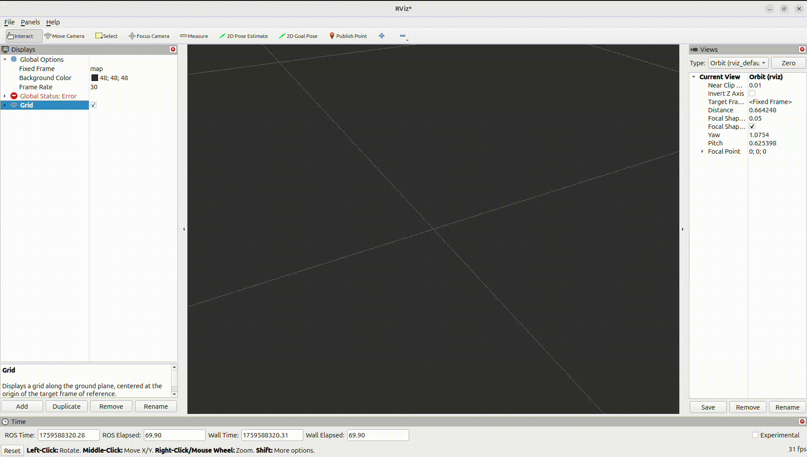

# ROS2-jazzy-workshop-01
Robot modeling is the cornerstone of modern robotics. The Unified Robot Description Format (URDF) is an XML-based language used in ROS to describe all aspects of a robot, including its physical structure, joints, and sensors. While URDF is powerful, its true potential is unleashed when combined with Xacro (XML Macros), which allows for the creation of reusable code snippets (macros) and mathematical calculations. This modular approach drastically simplifies the creation of complex robot models and makes it easier to manage and modify them. A solid understanding of these description files is crucial for any robotics developer, as many simulation failures in Gazebo, like unexpected collisions or unstable dynamics, often stem from incorrect robot descriptions, such as improperly defined masses or inertias.

During the modeling process, RViz, the ROS visualization tool, is an invaluable asset. It allows you to visualize your robot's URDF model, check for correct joint properties, and verify that all links, masses, and inertias are properly configured before you even attempt to simulate it. This early-stage validation saves significant time and effort. Ultimately, a properly described robot model is a prerequisite for effective simulation in Gazebo. Gazebo is a powerful 3D robotics simulator that provides a realistic environment to test and validate robot behaviors, from simple movements to complex sensor interactions, and is essential for developing and testing algorithms without the need for physical hardware.

Objectives Upon completion of this lab sheet, you will be able to:

- Create a ROS 2 package and navigate its structure.
- Understand and effectively use URDF, Xacro, and Macro for robot modeling.
- Understand the properties of different joint types and links.
- Familiarize yourself with the RViz visualization tool for model validation.
- Familiarize yourself with the Gazebo simulator and the gz_ros_bridge for communication with ROS 2.

Task 01: Setting up Your ROS 2 Workspace
========================================
This task will guide you through the process of setting up a new ROS 2 workspace and a dedicated package for your robot's description files.

Create Your Workspace Directory
-------------------------------
First, you'll create a new workspace directory for this workshop. Please replace **XX** with your batch number to personalize your workspace name. For example, if you are from the **22nd batch**, your workspace name will be **workshop_22_ws**.

    mkdir -p workshop_xx_ws/src
    
Next, navigate into your newly created workspace directory.

    cd workshop_xx_ws/src

Create the Robot Description Package
------------------------------------
Next, create a new ROS 2 package specifically for your robot's description files. We'll name this package robot_description. The --build-type ament_cmake flag specifies the build system we'll be using.

    ros2 pkg create --build-type ament_cmake robot_description
Add Your Workspace to VS Code
-----------------------------
For easier editing and project navigation, it's recommended to add your workspace's src folder to your VS Code environment.
- Open VS Code.
- Go to File > Add Folder to Workspace...
- select your workshop_XX_ws/src directory.

Create Necessary Folders
------------------------
To maintain a clean and organized package structure, please create three new folders inside your workshop_XX_robot_description package directory: **launch**, **urdf**, and **config**. These folders will be used to store your launch files, URDF/Xacro files, and configuration files, respectively.

Edit the CMakeLists.txt File
----------------------------
You need to modify your package's CMakeLists.txt file to ensure that the newly created folders and their contents are installed correctly. This step is crucial for making your files accessible to ROS 2.
After the line **find_package(ament_cmake REQUIRED)**, add the following:

    install(
    DIRECTORY urdf launch config
    DESTINATION share/robot_description
    )

Build Your Package
------------------
Finally, build your new package to compile any changes and make it available in your ROS 2 environment. You must execute this command from the **root of your workspace (workshop_XX_ws)**.
    
    colcon build
After a successful build ,source your workspace

    source install/setup.bash

Task 02: Creating a Simple URDF and Visualizing in RViz
=======================================================
In this task, you'll create a basic URDF file to model a simple robot and learn how to visualize it using RViz. This will help you verify your model's structure before moving to more complex simulations.

Create Your URDF File
---------------------
First, inside the urdf folder you created earlier, create a new file named robot_model.urdf. This file will contain the complete description of your robot.
**robot_model.urdf;**
    
    <?xml version="1.0" ?>
    <robot name="robot_model">
        <link name="world"/>
        <link name="base_link">
            <visual>
                <geometry>
                    <box size="0.3 0.2 0.05"/>
                </geometry>
            </visual>
        </link>
        
        <joint name="world_to_base" type="fixed">
            <parent link="world"/>
            <child link="base_link"/>
            <origin xyz="0 0 0" rpy="0 0 0"/>
        </joint>
        
    </robot>  

Create the Display Launch File
------------------------------
Next, create a new launch file named **display.launch.xml** inside your launch folder. This launch file will be used to launch a ROS 2 node that reads your URDF file and publishes the robot's state, which RViz will then use to visualize the model. 
**display.launch.xml;**

    <launch>
        <let name="urdf_path" 
            value="$(find-pkg-share robot_description)/urdf/robot_model.urdf" />
        
        <node pkg="robot_state_publisher" exec="robot_state_publisher">
            <param name="robot_description"
                value="$(command 'cat $(var urdf_path)')" />
        </node>
        <node pkg="rviz2" exec="rviz2" output="screen" />
    </launch>

Build and Launch Your Package
-----------------------------
Navigate to the root of your workspace (workshop_XX_ws) and build your package.After a successful build ,source your workspace

    colcon build
    source install/setup.bash
launch the display.launch.xml file to start RViz and view your robot.

    ros2 launch robot_description display.launch.xml
    
Configure and Save RViz Settings
--------------------------------
Once RViz is open, you will need to manually configure it to display your robot model. This involves adding the RobotModel display type and setting its topic. After you have the desired view, save the configuration.
- Click the "Add" button in the bottom-left corner of the RViz window.
- A new window will pop up.
- In the "By display type" tab, expand rviz_default_plugins and select RobotModel.
- Click "OK".
  
- In the "Displays" panel on the left, you will now see RobotModel as an option.
- Expand the RobotModel entry.
- Click on Description Topic and from the dropdown menu, select the /robot_description topic.
- Under the "Global Options" section at the top of the "Displays" panel, find the Fixed Frame dropdown menu.
- Click on it and select world frame.
- Click the "Add" button again.In the rviz_default_plugins section, select TF. Click "OK". This will show the coordinate frames of your robot, which is useful for debugging.

- In RViz, go to File > Save Config As... and save the file as rviz_config.rviz inside your config folder.

Update the Launch File with RViz Configuration
----------------------------------------------
To avoid manually configuring RViz every time you launch, you will now modify the **display.launch.xml** file. The updated launch file will load the **rviz_config.rviz** file automatically. 
**display.launch.xml;**

    <launch>
        <let name="urdf_path" 
            value="$(find-pkg-share robot_description)/urdf/robot_model.urdf" />
        <let name="rviz_config_path" 
            value="$(find-pkg-share robot_description)/config/rviz_config.rviz" />
        
        <node pkg="robot_state_publisher" exec="robot_state_publisher">
            <param name="robot_description"
                value="$(command 'cat $(var urdf_path)')" />
        </node>
        
        <node pkg="rviz2" exec="rviz2" output="screen"
            args="-d $(var rviz_config_path)" />
    </launch>

Rebuild, Source, and Launch
---------------------------
Finally, build your package again to apply the changes to the launch file. Then, source your workspace and launch the updated file. You will see RViz open with the correct configuration loaded automatically.

Task 03: Incorporating Xacro and Macros for Modular Robot Design
================================================================
This task will introduce you to Xacro (XML Macros) and how it can significantly simplify the creation and maintenance of complex robot models. We'll explore the benefits of using properties and reusable macros to build a robot description in a more organized and efficient manner.

Before we dive into the implementation, let's take a look at the robot design we aim to describe in this task.

Why Xacro and Macros?
---------------------
- **Reusability:** Instead of defining the geometry, visual, and collision properties of a box multiple times, we can create a single macro for a box shape and instantiate it with different names and parameters as needed. This significantly reduces redundancy and makes the URDF more readable and maintainable.
- **Parameterization:** Xacro allows us to define properties (variables) for dimensions, colors, or any other parameters of our robot. If we need to change the size of a particular link, we only need to modify the property's value in one place, and it will be updated throughout the model.
- **Organization:** By separating properties and reusable components (like our box macro) into different files, we can create a more modular and manageable robot description.

Create Property File:
---------------------
Inside your urdf folder, create a new file named box_macro.xacro. This file will contain the Xacro macro definition for creating a box-shaped link with specified dimensions.

    <?xml version="1.0"?>
    <robot xmlns:xacro="http://www.ros.org/wiki/xacro">
    <xacro:macro name="box_link" params="link_name size_x size_y size_z mass color_rgba xyz rpy">
        <link name="${link_name}">
            <!--visual properties-->
            <visual>
                <origin xyz="${xyz}" rpy="${rpy}"/>
                <geometry>
                    <box size="${size_x} ${size_y} ${size_z}"/>
                </geometry>
                <material name="${link_name}_mat">
                    <color rgba="${color_rgba}"/>
                </material>
            </visual>
            <!--collision properties-->
            <collision>
                <origin xyz="${xyz}" rpy="${rpy}"/>
                <geometry>
                  <box size="${size_x} ${size_y} ${size_z}"/>
                </geometry>
            </collision>
            <!--Inertia properties-->
            <inertial>
                <origin xyz="${xyz}" rpy="${rpy}"/>
                <mass value="${mass}" />
                <inertia
                    ixx="${(1.0/12.0) * float(mass) * (float(size_y)**2 + float(size_z)**2)}"
                      ixy="0.0"
                          ixz="0.0"
                              iyy="${(1.0/12.0) * float(mass) * (float(size_x)**2 + float(size_z)**2)}"
                                  iyz="0.0"
                                      izz="${(1.0/12.0) * float(mass) * (float(size_x)**2 + float(size_y)**2)}"/>
            </inertial>
        </link>
    </xacro:macro>
    </robot>

Create the Main Robot URDF File:
--------------------------------
In the same urdf folder, create your main robot description file named robot_model.urdf.xacro. This file will import the properties and the box macro and use them to define the structure of our three-link robot.

    <?xml version="1.0"?>
    <robot xmlns:xacro="http://www.ros.org/wiki/xacro" name="robot_model">
        <!-- include macros -->
        <xacro:include filename="$(find robot_description)/urdf/box_macro.xacro" />
        <!-- Define xacro properties -->
        <xacro:property name="base_length" value="0.50"/>
        <xacro:property name="base_width" value="0.05"/>
        <xacro:property name="base_height" value="0.05"/> 
        <xacro:property name="base_mass" value="1.0"/>
        <xacro:property name="base_color" value="0.9 0.4 0.2 1"/>
    
        <xacro:property name="base_visual_xyz" value="${(float(base_length)/2.0)} 0 0"/>
        <xacro:property name="base_visual_rpy" value="0 0 0"/>
    
        <link name="world"/>
    
        <xacro:box_link
            link_name="base_link"
            size_x="${base_length}"
            size_y="${base_width}"
            size_z="${base_height}"
            mass="${base_mass}"
            color_rgba="${base_color}"
            xyz="${base_visual_xyz}"
            rpy="${base_visual_rpy}" />
    
        <joint name="world_to_base" type="fixed">
            <origin xyz="0 0 0" rpy="0 -1.57 0"/>
            <parent link="world"/>
            <child  link="base_link"/>    
        </joint>
    
    </robot>
Modify the Launch File:
-----------------------
Now, you need to update your **display.launch.xml** file to process the .urdf.xacro file instead of a regular .urdf file. Open your display.launch.xml and find the line that defines the urdf_path argument and the subsequent tag where the URDF content is loaded. You need to change the command used to process the URDF. Specifically, replace 'cat' with 'xacro' in the following part:

    value="$(command 'cat $(var urdf_path)')"
It should look like this after the change:

    value="$(command 'xacro $(var urdf_path)')"

Rebuild, Source, and Launch
---------------------------
You must build your package again to apply the changes to the launch file. From now on, it's recommended to build with the **--symlink-install** flag. This creates a symbolic link between your source files and the install directory, meaning you won't have to rebuild the package every time you make a change to a Python file, a launch file, or an URDF. This is a huge time saver when you're repeatedly modeling and visualizing a robot.

    colcon build --symlink-install
Creating the Next Arm Link and a Revolute Joint
-----------------------------------------------
Now that you have your Xacro and Macro files set up, let's add the next link to our robot model. This next link will be a revolute joint, which allows for rotation around a single axis. We will also add a new set of properties to define the dimensions and other parameters of this arm.

First, you will define the properties for the new arm link.
- In your robot_properties.xacro file, define a new set of properties for the arm1_link. Use a length of 0.30, a width of 0.05, and a height of 0.05. Set the mass to 0.6 and the color to 0.4 0.9 0.2 1. You'll also need to define the visual offset (arm1_visual_xyz) and rotation (arm1_visual_rpy).

Next, you will define a new link and a revolute joint that connects it to your base link.
- Create the box shape: Using your box_macro, create a new link with the name arm1_link. Use the properties you just defined for its size, mass, color, and visual position.
- Create the continuous joint: Define a new joint with the name base_arm1_joint and the type continuous. This joint will connect the base_link (parent) and arm1_link (child).

----------------
    <xacro:property name="arm1_length" value="0.30"/>
    <xacro:property name="arm1_width" value="0.05"/> 
    <xacro:property name="arm1_height" value="0.05"/>
    <xacro:property name="arm1_mass" value="0.6"/>
    <xacro:property name="arm1_color" value="0.4 0.9 0.2 1"/>
    
    <xacro:property name="arm1_visual_xyz" value="${(float(arm1_length)/2.0)} 0 0"/>
    <xacro:property name="arm1_visual_rpy" value="0 0 0"/>
-------------------
    <xacro:box_link
        link_name="arm1_link"
        size_x="${arm1_length}"
        size_y="${arm1_width}"
        size_z="${arm1_height}"
        mass="${arm1_mass}"
        color_rgba="${arm1_color}"
        xyz="${arm1_visual_xyz}"
        rpy="${arm1_visual_rpy}" />
--------------------
    <joint name="base_to_arm1" type="continuous">
        <origin xyz="${float(base_length) - float(arm1_height)} ${float(arm1_height)} 0" rpy="0 0 0"/>
        <parent link="base_link"/>
        <child  link="arm1_link"/>
        <axis  xyz="0 1 0"/>
    </joint>
---------------------
When you launch your updated display.launch.xml file, you will encounter an error in RViz that says **"No transform from [arm1_link] to [world]"**. This happens because your robot's joints are not being published to a topic, so RViz doesn't know where to place your arm1_link relative to the world frame.

To solve this, you need to add a node to your launch file that publishes the joint states. The joint_state_publisher_gui package is perfect for this. It not only publishes the joint states but also provides a graphical interface that allows you to manually manipulate the joints. This is a great tool for confirming that your joints are properly defined and placed correctly.

Add the following line to your display.launch.xml file:

    <node pkg="joint_state_publisher_gui" exec="joint_state_publisher_gui" />
After adding this line, You will see a new window with sliders that control your robot's joints. Use the slider to move the arm1_link and verify that the revolute joint is working as expected. This process helps you ensure that your joint's axis and origin are correctly configured.

Exercise 01 : Creating a Differential Drive Mobile Robot
========================================================
Your task is to create a new ROS 2 package and model a differential drive mobile robot from scratch. This is a common and fundamental robot configuration in robotics.

Instructions:

1. Create a New Package: Create a new ROS 2 package named mobilebot_description.
2. Define Xacro Properties: Create a new Xacro file to define the properties for your mobile robot. Make sure you include the following parameters: wheel_radius: Set this to 0.05 meters. wheel_separation: Set this to 0.3 meters. You have the freedom to choose the shape, dimensions, and mass for the main chassis and wheels of your mobile robot.
3. Use Xacro Macros: Create a reusable Xacro macro for the wheel shape. This will save you from having to write the code for the left and right wheels separately.
4. Assemble the Robot: Create a final Xacro file that imports your properties and wheel macro. Use the macros to define the main chassis and connect the two wheels using continuous joints. Pay close attention to the origin and axis of the joints to ensure the wheels are placed correctly and can rotate. Visualize your robot in RViz to ensure all links and joints are correctly configured.

This exercise will reinforce your understanding of using Xacro and macros to build a well-structured and easily modifiable robot model.

Useful links:
-------------
- [https://wiki.ros.org/urdf](https://wiki.ros.org/urdf/XML/model)
- [https://wiki.ros.org/urdf/XML/link](https://wiki.ros.org/urdf/XML/link)
- [https://wiki.ros.org/urdf/XML/joint](https://wiki.ros.org/urdf/XML/joint)
