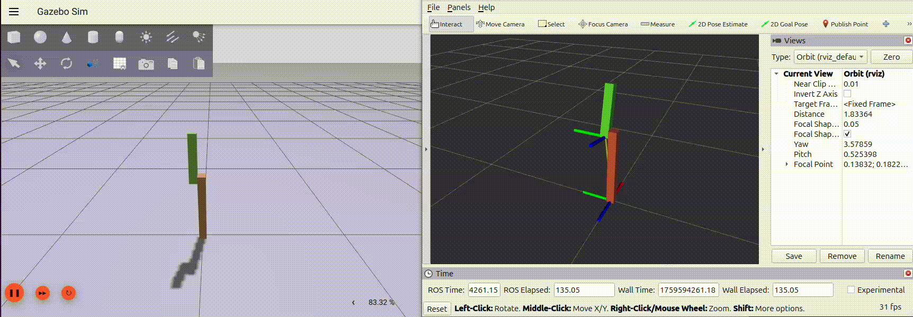

Task 04: Spawning the Robot Model in Gazebo
===========================================
This task will guide you through the process of spawning your robot model into a Gazebo simulation environment and using ros_gz_bridge to connect Gazebo's joint state data to ROS 2. This is a crucial step for controlling and visualizing your robot's behavior in a simulated world.

Create a New Launch File
------------------------
First, create a new launch file inside your launch folder named **bringup.launch.xml**. This file will be used to launch both the Gazebo simulation environment and your robot model.

    <launch>
        <let name="urdf_path" 
            value="$(find-pkg-share robot_description)/urdf/robot_model.urdf.xacro" />
        <let name="rviz_config_path" 
            value="$(find-pkg-share robot_description)/config/rviz_config.rviz" />
        <executable cmd="gz sim empty.sdf" output="screen"/>
    
        <node pkg="robot_state_publisher" exec="robot_state_publisher" output="screen">
            <param name="robot_description" value="$(command 'xacro $(var urdf_path)')" />
        </node>
        
        <node pkg="rviz2" exec="rviz2" output="screen" args="-d $(var rviz_config_path)"/>
        
        <include file="$(find-pkg-share ros_gz_sim)/launch/gz_spawn_model.launch.py">
            <arg name="world" value="empty"/>
            <arg name="topic" value="/robot_description"/>
            <arg name="entity_name" value="robot_arm"/>
        </include>
        
    </launch>

Build and Launch
----------------
Since you have created a new launch file, you must build your package again. Remember to use --symlink-install to avoid future rebuilds for non-code changes. After building, source your workspace and launch the bringup.launch.xml file.

    ros2 launch robot_description bringup.launch.xml

Your robot model will now appear in an empty Gazebo world. However, you'll notice a familiar error in RViz: "No transform from [arm1_link] to [world]". This is because RViz is not yet receiving the joint state data from Gazebo.

Add the Gazebo Joint State Publisher Plugin
-------------------------------------------
To get the joint states from Gazebo, you need to add a Gazebo plugin to your robot's URDF. Inside your urdf folder, create a new file named **gz_properties.xacro**. This file will contain the necessary plugin code to publish the joint states to a Gazebo topic.

You can find a list of available Gazebo plugins here: [https://gazebosim.org/api/sim/9/classes.html](https://gazebosim.org/api/sim/9/classes.html)

    <?xml version="1.0"?>
    <robot xmlns:xacro="http://www.ros.org/wiki/xacro">
        <gazebo>
            <plugin
                filename="ignition-gazebo-joint-state-publisher-system" 
                name="ignition::gazebo::systems::JointStatePublisher ">
                <topic>joint_states</topic>
            </plugin>
        </gazebo>  
    </robot>

Now, you need to include the gz_properties.xacro file in your main robot description file. To do this, add the following line to the top of your robot_model.urdf.xacro file:

    <xacro:include filename="$(find robot_description)/urdf/gz_properties.xacro" />

Verify Gazebo Topic Publication
-------------------------------
After adding the plugin and rebuilding your package, launch the bringup.launch.xml file again. To confirm the joint states are being published, open a new terminal and use the gz command to list the running topics and identify the type name publishing joint state information.

To see a list of all currently running Gazebo topics, use the following command in your terminal:

    gz topic -l
Once you have identified the topic publishing joint state information (it will likely have joint_states in its name), you can get more information about its type and structure by using this command, replacing /topic_name with the actual topic name:
    
    gz topic -i -t /topic_name

Create the ROS-Gazebo Bridge Configuration
------------------------------------------
To bridge the Gazebo topic to a ROS 2 topic that RViz can understand, you'll use ros_gz_bridge. Inside your config folder, create a new file named **ros_gz_bridge.yaml**. This file will define the mapping between the Gazebo topic and the ROS 2 topic.

    -   ros_topic_name: "/joint_states"
        gz_topic_name: "/joint_states"
        ros_type_name: "sensor_msgs/msg/JointState"
        gz_type_name: "gz.msgs.Model"
        direction: GZ_TO_ROS
Update the Launch File
----------------------
Next, you must modify your bringup.launch.xml file to include the ros_gz_bridge and load the configuration file you just created. You will add a new node at the end of the launch file for this purpose.

    <node pkg="ros_gz_bridge" exec="parameter_bridge" name="ros_gz_bridge" output="screen">
        <param name="config_file" value="$(var ros_gz_bridge_path)"/>
        <param name="qos_overrides./tf_static.publisher.durability" value="transient_local"/>
    </node>
Final Build and Launch
----------------------
Finally, build your package one last time to apply the changes to the launch file. Source your workspace and launch the bringup.launch.xml file. This time, RViz will correctly display the robot's state as published by Gazebo, allowing you to see its behavior in the simulation.

Exercise 02 : Spawning and Controlling a Differential Drive Robot
=================================================================
Your next exercise is to spawn the differential drive mobile robot you created earlier into a Gazebo environment and control it using your keyboard. This will involve adding a Gazebo differential drive plugin to your robot model and using ros_gz_bridge to send commands from ROS 2 to Gazebo.

1. Add the Differential Drive Plugin
2. Set Up the ROS-Gazebo Bridge
    - In this file, you'll need to set up a bridge to convert a Twist message from a ROS 2 topic (e.g., /cmd_vel) to a Gazebo topic that the differential drive plugin listens to.
3. Update the Launch File
4. Control the Robot from the Keyboard
    Use the following command to start the keyboard control node, replacing /cmd_vel if your topic name is different:

       ros2 run teleop_twist_keyboard teleop_twist_keyboard --ros-args --remap cmd_vel:=/cmd_vel
  
In your mobilebot.urdf.xacro file, add the Gazebo Odometry plugin to your robot model. Then, configure the ros_gz_bridge.yaml file to bridge the Gazebo odometry topic to a ROS 2 topic. Finally, in RViz, add the Odometry display and subscribe to that new ROS 2 topic to visualize the robot's movement.
